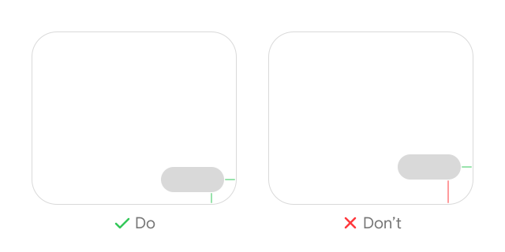
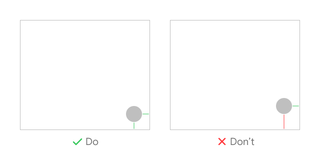
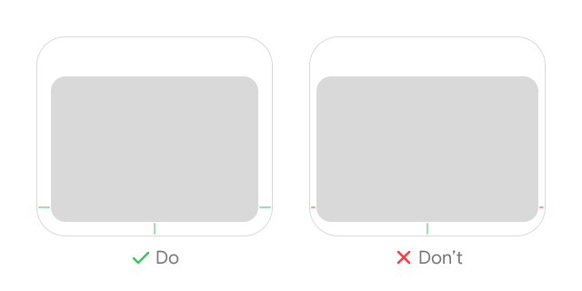
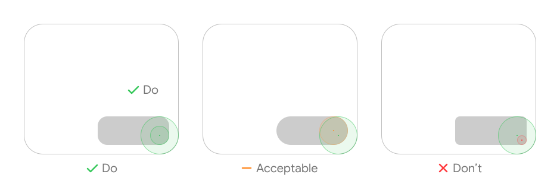

# UI Design Rules

## Element should have equal x and y spacing from its container edges

This applies regardless of element or container shape:

The same principle applies when an element is inset from multiple edges:

## Element should be concentric to its container

The ideal element radius can be calculated as `elementRadius = containerRadius - inset`. For example, if `containerRadius = 32px` and `inset = 16px`, the ideal `elementRadius` is `16px`.

When choices are limited, an `elementRadius` that is slightly larger than the ideal radius is acceptable. Never use a radius smaller than the ideal value.
